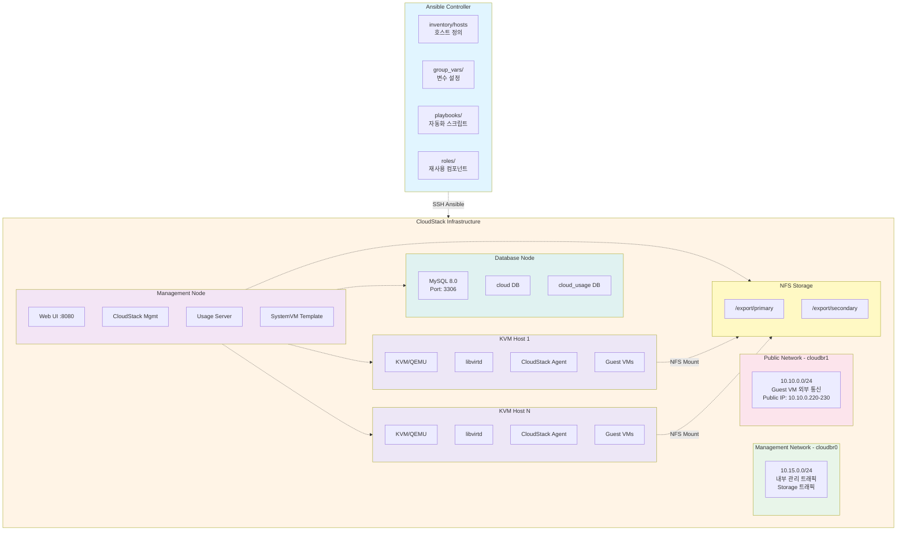
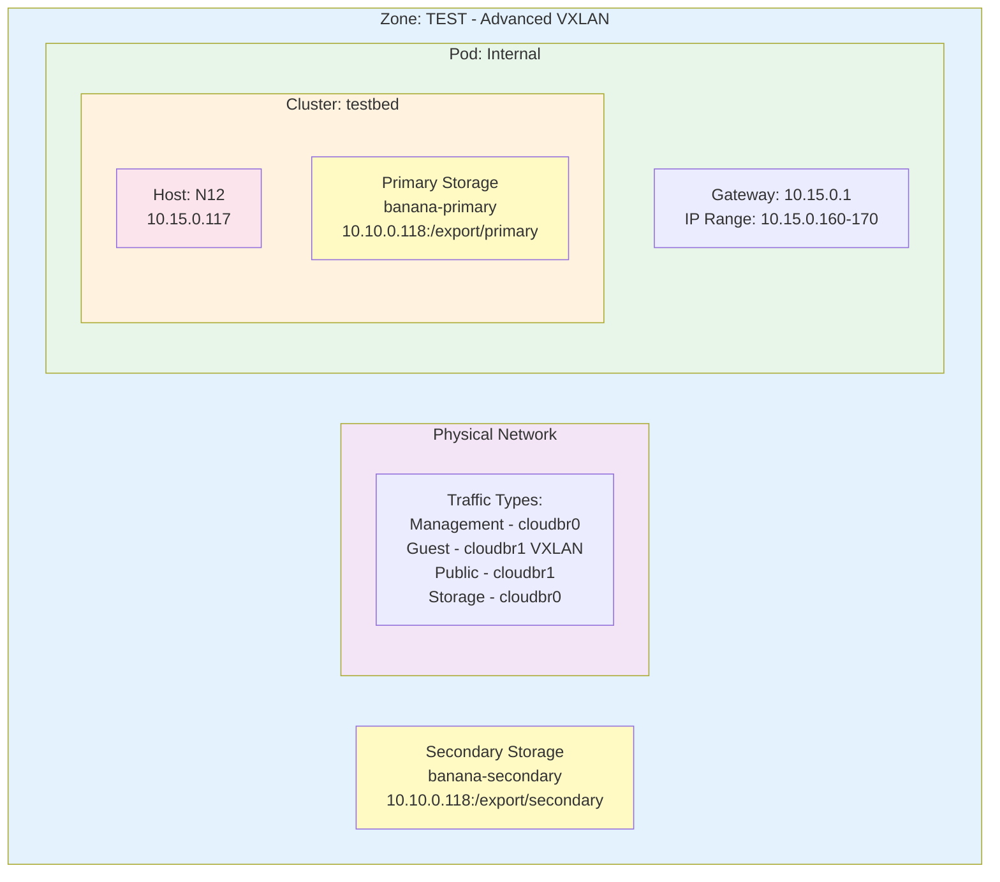
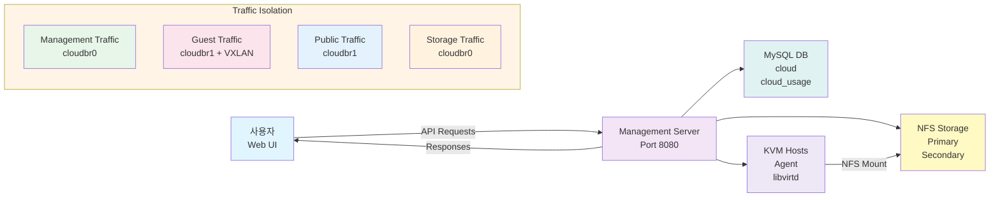
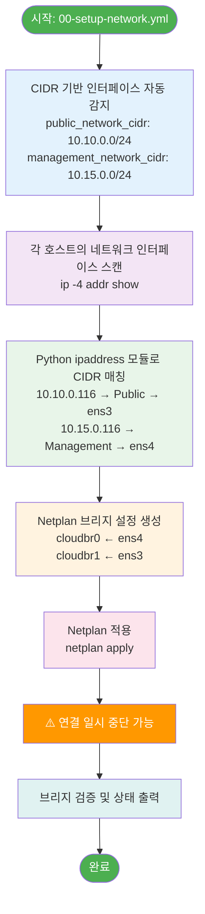
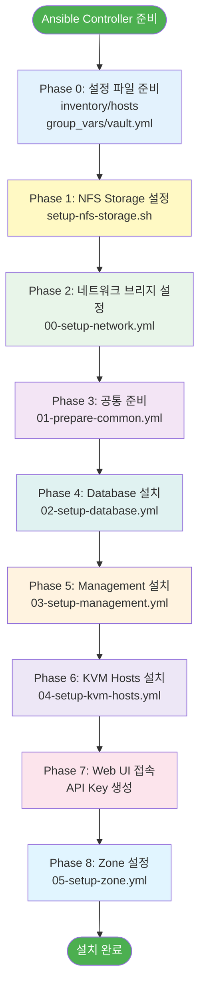

# CloudStack Infrastructure Automation - 상세 문서

> Apache CloudStack 4.19 자동 배포를 위한 Ansible 기반 Infrastructure as Code 프로젝트

**작성일**: 2025-12-31  
**버전**: CloudStack 4.19.3.0  
**테스트 환경**: Ubuntu 24.04 LTS

---

## 📋 목차

1. [프로젝트 개요](#프로젝트-개요)
2. [아키텍처](#아키텍처)
3. [디렉토리 구조](#디렉토리-구조)
4. [네트워크 설계](#네트워크-설계)
5. [설치 프로세스](#설치-프로세스)
6. [주요 컴포넌트](#주요-컴포넌트)
7. [변수 설정](#변수-설정)
8. [트러블슈팅](#트러블슈팅)
9. [유지보수](#유지보수)

---

## 프로젝트 개요

### 목적
Apache CloudStack 클라우드 인프라의 **완전 자동화 배포**를 제공하여 수동 설치의 복잡성을 제거하고, 재현 가능한(reproducible) IaaS 환경을 구축합니다.

### 주요 기능
- ✅ **완전 자동화**: Management Server, Database, KVM Hypervisor, NFS Storage 자동 설치
- ✅ **네트워크 자동 감지**: CIDR 기반으로 인터페이스를 자동으로 찾아 브리지 구성
- ✅ **Advanced Zone 지원**: VXLAN 기반 네트워크 격리, Floating IP 지원
- ✅ **고가용성 준비**: Database 분리, 다중 KVM 호스트 지원
- ✅ **보안 강화**: Ansible Vault를 통한 비밀번호 암호화
- ✅ **문제 해결**: SSVM 인증서 문제, SystemVM 재설치 자동화

### 지원 환경
| 항목 | 버전/사양 |
|------|-----------|
| CloudStack | 4.19.3.0 |
| OS | Ubuntu 24.04 LTS (Noble) |
| MySQL | 8.0 |
| Java | OpenJDK 11 |
| Hypervisor | KVM/QEMU |
| Network | Advanced Zone (VXLAN) |
| Ansible | 2.9+ |

---

## 아키텍처

### 전체 시스템 구성도



### CloudStack Zone 아키텍처



### 데이터 흐름도



### 네트워크 자동 설정 프로세스



### 설치 프로세스 순서



---

## 디렉토리 구조

### 프로젝트 전체 구조

```
cloudstack-infra/
│
├── README.md                          # 프로젝트 소개 및 빠른 시작 가이드
├── DOCUMENTATION.md                   # 이 파일 (상세 문서)
│
├── cloudstack/                        # ⭐ Ansible 자동화 메인 디렉토리
│   ├── ansible.cfg                    # Ansible 설정 (SSH 설정, 로그 등)
│   ├── README.md                      # Ansible 플레이북 사용 가이드
│   ├── INSTALL.md                     # 단계별 설치 가이드
│   ├── PROJECT_SUMMARY.md             # 프로젝트 구조 요약
│   ├── setup-ansible-controller.sh    # Ansible Controller 초기 설정 스크립트
│   │
│   ├── inventory/                     # 📦 인벤토리 및 변수
│   │   ├── hosts                      # 호스트 정의 (실제 서버 IP)
│   │   ├── hosts.example              # 호스트 정의 예시
│   │   │
│   │   └── group_vars/                # 그룹별 변수
│   │       ├── all/                   # 모든 호스트에 적용되는 변수
│   │       │   ├── all.yml            # 공통 설정 (버전, CIDR, 브리지 등)
│   │       │   └── vault.yml          # 암호화된 비밀번호 (Ansible Vault)
│   │       │
│   │       ├── database.yml           # Database 서버 설정
│   │       ├── management.yml         # Management 서버 설정
│   │       ├── kvm-hosts.yml          # KVM Hypervisor 설정
│   │       └── zone.yml               # CloudStack Zone 설정 (중요!)
│   │
│   ├── playbooks/                     # 🎭 Ansible Playbooks
│   │   ├── site.yml                   # 📌 전체 설치 메인 플레이북
│   │   │
│   │   ├── 00-setup-network.yml       # 네트워크 브리지 자동 설정
│   │   ├── 01-prepare-common.yml      # 공통 준비 (NTP, 패키지 등)
│   │   ├── 02-setup-database.yml      # MySQL 설치 및 설정
│   │   ├── 03-setup-management.yml    # Management Server 설치
│   │   ├── 04-setup-kvm-hosts.yml     # KVM Hypervisor 설치
│   │   ├── 05-setup-zone.yml          # Zone 설정 (Pod, Cluster, Host 등록)
│   │   │
│   │   ├── fix-mysql-binding.yml      # MySQL 원격 접속 문제 해결
│   │   ├── troubleshoot-ssvm.yml      # SSVM 인증서 문제 해결
│   │   ├── reinstall-systemvm.yml     # SystemVM 템플릿 재설치
│   │   ├── verify-kvm-hosts.yml       # KVM 호스트 검증
│   │   └── setup-network-interactive.yml  # 대화형 네트워크 설정
│   │
│   └── roles/                         # 🎯 Ansible Roles (재사용 컴포넌트)
│       │
│       ├── common/                    # 공통 설정 Role
│       │   ├── tasks/main.yml         # 기본 패키지, NTP, Chrony 설정
│       │   ├── handlers/main.yml      # 서비스 재시작 핸들러
│       │   ├── templates/
│       │   │   └── chrony.conf.j2     # NTP 설정 템플릿
│       │   └── meta/main.yml          # Role 메타데이터
│       │
│       ├── database/                  # Database Role
│       │   ├── tasks/main.yml         # MySQL 8.0 설치, 최적화 설정
│       │   ├── handlers/main.yml      # MySQL 재시작
│       │   ├── templates/
│       │   │   └── root-my.cnf.j2     # MySQL root 설정
│       │   └── meta/main.yml
│       │
│       ├── management/                # Management Server Role
│       │   ├── tasks/main.yml         # CloudStack Mgmt, Usage, SystemVM
│       │   ├── handlers/main.yml      # Management 서비스 재시작
│       │   └── meta/main.yml
│       │
│       └── kvm-host/                  # KVM Hypervisor Role
│           ├── tasks/main.yml         # KVM, libvirt, Agent 설치
│           ├── handlers/main.yml      # libvirtd 재시작
│           ├── templates/
│           │   └── netplan-bridge.yaml.j2  # 네트워크 브리지 템플릿
│           └── meta/main.yml
│
├── storage-node/                      # 💾 NFS Storage 독립 설치
│   └── nfs-server/
│       └── setup-nfs-storage.sh       # NFS 서버 자동 설치 스크립트
│                                      # (디스크 파티션, 포맷, export 설정)
│
└── mgmt-node/                         # 🛠️ Management 노드 유틸리티
    ├── install-cloudmonkey.sh         # CloudMonkey CLI 설치 스크립트
    └── nfs-server/
        ├── register-primary-storage.sh    # Primary Storage 등록
        └── register-secondary-storage.sh  # Secondary Storage 등록
```

### 주요 파일 상세 설명

#### 🔧 설정 파일

| 파일 | 용도 | 수정 필요 |
|-----|------|----------|
| `inventory/hosts` | 실제 서버 IP 주소 정의 | ✅ 필수 |
| `group_vars/all/all.yml` | CloudStack 버전, 네트워크 CIDR, 브리지 이름 | ✅ 필수 |
| `group_vars/all/vault.yml` | 암호화된 비밀번호 (MySQL, KVM) | ✅ 필수 |
| `group_vars/zone.yml` | Zone 설정 (API Key, Pod, Cluster, Storage) | ✅ 설치 후 |
| `group_vars/management.yml` | NFS 서버 IP, Storage Path | ✅ 필수 |

#### 🎭 핵심 Playbook

| Playbook | 실행 순서 | 작업 내용 |
|---------|---------|----------|
| `site.yml` | Main | 전체 설치 프로세스 오케스트레이션 |
| `00-setup-network.yml` | 1 | CIDR 기반 인터페이스 자동 감지 및 브리지 생성 |
| `01-prepare-common.yml` | 2 | NTP, 기본 패키지, apt lock 해제 |
| `02-setup-database.yml` | 3 | MySQL 8.0 설치, CloudStack 최적화 |
| `03-setup-management.yml` | 4 | Management Server, SystemVM Template |
| `04-setup-kvm-hosts.yml` | 5 | KVM, libvirt, CloudStack Agent |
| `05-setup-zone.yml` | 6 | Zone, Pod, Cluster, Host, Storage 등록 |

---

## 네트워크 설계

### 네트워크 요구사항

CloudStack Advanced Zone은 **최소 2개의 물리적으로 분리된 네트워크**가 필요합니다:

#### 1️⃣ **Public Network** (cloudbr1)
- **CIDR**: `10.10.0.0/24` (예시)
- **용도**: 
  - Guest VM의 인터넷 연결
  - Public IP 할당 (Floating IP)
  - System VM (SSVM, CPVM) 외부 통신
  - Virtual Router 외부 인터페이스
- **Traffic Types**: `Guest`, `Public`
- **Public IP Range**: `10.10.0.220 - 10.10.0.230`
- **Gateway**: `10.10.0.1`

#### 2️⃣ **Management Network** (cloudbr0)
- **CIDR**: `10.15.0.0/24` (예시)
- **용도**:
  - CloudStack 내부 관리 트래픽
  - Management Server ↔ Hypervisor 통신
  - Hypervisor ↔ Storage 통신
  - Pod IP Range (System VM 내부 통신)
- **Traffic Types**: `Management`, `Storage`
- **Pod IP Range**: `10.15.0.160 - 10.15.0.170`
- **Gateway**: `10.15.0.1`

### 네트워크 자동 설정 프로세스

`00-setup-network.yml` Playbook이 다음을 자동으로 수행한다.

 1. CIDR 기반 인터페이스 자동 감지
    - public_network_cidr (10.10.0.0/24)                  
    - management_network_cidr (10.15.0.0/24)              
 2. 각 호스트의 모든 네트워크 인터페이스 스캔 
    - ip -4 addr show 실행 
 3. Python ipaddress 모듈로 CIDR 매칭 
    - 10.10.0.116 → Public Network → ens3 
    - 10.15.0.116 → Management Network → ens4 
 4. Netplan 브리지 설정 생성 
    - cloudbr0 (Management) ← ens4 
    - cloudbr1 (Public) ← ens3 
 5. Netplan 적용 (netplan apply)
    > ⚠️  연결이 일시적으로 끊길 수 있음 

 6. 브리지 검증 및 상태 출력                                 


### 네트워크 설정 예시

**Netplan 설정 (`/etc/netplan/01-cloudstack-network.yaml`)**:

```yaml
network:
  version: 2
  renderer: networkd
  
  ethernets:
    # Public Network 인터페이스
    ens3:
      dhcp4: no
      dhcp6: no
    
    # Management Network 인터페이스
    ens4:
      dhcp4: no
      dhcp6: no
  
  bridges:
    # Management Bridge (cloudbr0)
    cloudbr0:
      interfaces: [ens4]
      addresses:
        - 10.15.0.116/24
      routes:
        - to: 10.15.0.0/24
          via: 10.15.0.1
      nameservers:
        addresses: [8.8.8.8, 8.8.4.4]
      parameters:
        stp: false
        forward-delay: 0
    
    # Public Bridge (cloudbr1)
    cloudbr1:
      interfaces: [ens3]
      addresses:
        - 10.10.0.116/24
      routes:
        - to: default
          via: 10.10.0.1
      nameservers:
        addresses: [8.8.8.8, 8.8.4.4]
      parameters:
        stp: false
        forward-delay: 0
```

### VXLAN 네트워크 격리

- **Isolation Method**: VXLAN
- **VNI Range**: 5000 - 6000
- **용도**: Guest VM 간 L2 네트워크 격리
- **특징**:
  - 각 Guest Network마다 고유한 VNI 할당
  - VLAN 4096개 제한을 넘어서는 확장성
  - Overlay 네트워크로 물리적 네트워크 독립성

> [주의] VXLAN을 사용하는 경우, VM 간의 네트워크 통신 경로 중에 가장 작은 MTU 값을 기준으로 -50 혹은 -80 정도 뺀 MTU 사이즈로 세팅할 것

---

## 설치 프로세스

### 사전 준비 체크리스트

- Ubuntu 24.04 서버 최소 3대 (Management, KVM, NFS)
- 각 서버에 SSH 접근 가능 (boan 사용자, sudo 권한)
- 2개의 네트워크 인터페이스 (Public, Management)
- NFS Storage용 추가 디스크 (`/dev/sdb` 등)
- Ansible Controller 환경 (로컬 또는 별도 서버)
- 충분한 리소스:
  - Management: 4GB RAM, 2 vCPU, 50GB Disk
  - Database: 4GB RAM, 2 vCPU, 50GB Disk
  - KVM: 8GB+ RAM, 4+ vCPU, 100GB+ Disk
  - NFS: 2GB RAM, 2 vCPU, 500GB+ Disk

### 설치 단계

#### 📝 Phase 0: Ansible Controller 준비

```bash
# 1. 저장소 클론
git clone https://github.com/boanlab/cloudstack-infra.git
cd cloudstack-infra/cloudstack

# 2. Ansible Controller 초기 설정 
chmod +x setup-ansible-controller.sh
./setup-ansible-controller.sh
```

#### 📝 Phase 1: 설정 파일 준비

```bash
# 1. Inventory 설정
vi inventory/hosts
```

**예시**:
```ini
[management]
cloudstack-mgmt ansible_host=10.10.0.116

[database]
cloudstack-db ansible_host=10.10.0.116

[kvm-hosts]
kvm-host-01 ansible_host=10.10.0.117

[cloudstack:children]
management
database
kvm-hosts

[cloudstack:vars]
ansible_user=USERNAME
ansible_password=PASSWORD
ansible_python_interpreter=/usr/bin/python3
```

```bash
# 2. Vault 비밀번호 설정
vi inventory/group_vars/all/vault.yml
```

**예시**:
```yaml
---
vault_mysql_root_password: "PLEASEFIX123"
vault_cloudstack_db_password: "PLEASEFIX123"
vault_kvm_host_password: "PLEASEFIX123"
```

**암호화 (선택)**:
```bash
ansible-vault encrypt inventory/group_vars/all/vault.yml
# Password: [vault 암호 입력]
```

```bash
# 3. 공통 설정 확인
vi inventory/group_vars/all/all.yml
```

**주요 설정**:
```yaml
---
# CloudStack 버전
cloudstack_version: "4.19.3.0"

# 네트워크 CIDR (실제 환경에 맞게 수정)
public_network_cidr: "10.10.0.0/24"
management_network_cidr: "10.15.0.0/24"

# 브리지 이름
management_bridge: "cloudbr0"
public_bridge: "cloudbr1"

# 시스템 설정
timezone: "Asia/Seoul"
java_package: "openjdk-11-jre-headless"

# DNS 서버
dns_servers:
  - 168.126.63.1
  - 8.8.8.8
```

```bash
# 4. Management 서버 설정
vi inventory/group_vars/management.yml
```

**주요 설정**:
```yaml
---
# NFS 서버 정보 (실제 IP로 변경)
nfs_server: "10.10.0.118"
nfs_secondary_path: "/export/secondary"
nfs_primary_path: "/export/primary"

# Database 연결
db_host: "{{ hostvars[groups['database'][0]]['ansible_host'] }}"
db_port: 3306
```

#### Phase 2: NFS Storage 설정

NFS 서버에서 직접 실행:

```bash
# 스크립트 다운로드 및 실행
cd /tmp
wget https://raw.githubusercontent.com/boanlab/cloudstack-infra/main/storage-node/nfs-server/setup-nfs-storage.sh
chmod +x setup-nfs-storage.sh

# NFS 설치 (자동 확인 모드)
sudo ./setup-nfs-storage.sh -d /dev/sdb -e /export

# 또는 대화형 모드
sudo ./setup-nfs-storage.sh -d /dev/sdb -e /export -n
```

**NFS 설정 확인**:
```bash
# Export 확인
showmount -e localhost

# 출력 예시:
# /export 10.10.0.0/24
```

#### Phase 3: CloudStack 전체 설치

Ansible Controller에서 실행:

```bash
cd /home/boan/cloudstack-infra/cloudstack

# 연결 테스트
ansible all -i inventory/hosts -m ping --ask-pass

# 전체 설치 실행
ansible-playbook -i inventory/hosts playbooks/site.yml \
  --ask-pass \
  --ask-become-pass \
  --ask-vault-pass  # vault 암호화한 경우
```

**설치 진행 상황**:
```
PLAY [CloudStack Infrastructure Setup] *********************************

TASK [Check connectivity] **********************************************
ok: [cloudstack-mgmt]
ok: [cloudstack-db]
ok: [kvm-host-01]

PLAY [Automatic Network Bridge Setup] **********************************
...

PLAY [Prepare Common] **************************************************
...

PLAY [Setup Database] **************************************************
...

PLAY [Setup Management Server] *****************************************
...

PLAY [Setup KVM Hosts] *************************************************
...

PLAY RECAP *************************************************************
cloudstack-mgmt        : ok=45   changed=23   failed=0
cloudstack-db          : ok=38   changed=18   failed=0
kvm-host-01            : ok=32   changed=15   failed=0
```

#### Phase 4: Web UI 접속 및 초기 설정

1. **Management Server 접속**:
   ```
   http://10.10.0.116:8080/client
   ```

2. **로그인**:
   - Username: `admin`
   - Password: `password`

3. **비밀번호 변경** (필수)

4. **API Key 생성**:
   - 우측 상단 프로필 → API Keys → Generate API Keys
   - API Key와 Secret Key 복사

#### ⚙️ Phase 5: Zone 설정

```bash
# 1. Zone 설정 파일 수정
vi inventory/group_vars/zone.yml
```

**API Key 및 Zone 정보 입력**:
```yaml
---
# CloudStack API 설정
cs_api_key: "YOUR_API_KEY_HERE"
cs_api_secret: "YOUR_SECRET_KEY_HERE"

# Zone 설정
zone_name: "TEST"
zone_dns1: "8.8.8.8"
zone_dns2: "8.8.4.4"
zone_network_type: "Advanced"
# GUEST_CIDR은 하위 L3 네트워크 대역과 중첩되지 않도록 주의할 것 
zone_guest_cidr: "192.168.0.0/24"

# Physical Networks
cloudstack_physical_networks:
  - name: "PhysicalNetwork"
    isolation_methods: "VXLAN"
    vlan_range: "5000-6000"
    traffic_types:
      - type: "Management"
        kvm_networklabel: "cloudbr0"
      - type: "Guest"
        kvm_networklabel: "cloudbr1"
      - type: "Public"
        kvm_networklabel: "cloudbr1"
      - type: "Storage"
        kvm_networklabel: "cloudbr0"

# Public IP 범위
cloudstack_public_ip_ranges:
  - physical_network_name: "PhysicalNetwork"
    start_ip: "10.10.0.220"
    end_ip: "10.10.0.230"
    gateway: "10.10.0.1"
    netmask: "255.255.255.0"
    vlan: "untagged"

# Pods
cloudstack_pods:
  - name: "Internal"
    gateway: "10.15.0.1"
    netmask: "255.255.255.0"
    start_ip: "10.15.0.160"
    end_ip: "10.15.0.170"

# Clusters
cloudstack_clusters:
  - name: "testbed"
    pod_name: "Internal"
    hypervisor: "KVM"
    cluster_type: "CloudManaged"

# Hosts
cloudstack_hosts:
  - name: "N12"
    cluster_name: "testbed"
    pod_name: "Internal"
    ip: "10.15.0.117"
    username: "root"
    password: "{{ vault_kvm_host_password | default('qhdks') }}"

# Primary Storage
cloudstack_primary_storages:
  - name: "banana-primary"
    cluster_name: "testbed"
    pod_name: "Internal"
    server: "10.10.0.118"
    path: "/export/primary"
    scope: "cluster"

# Secondary Storage
cloudstack_secondary_storages:
  - name: "banana-secondary"
    server: "10.10.0.118"
    path: "/export/secondary"
    provider: "NFS"
```

```bash
# 2. Zone 설정 실행
ansible-playbook -i inventory/hosts playbooks/05-setup-zone.yml \
  --ask-pass \
  --ask-become-pass \
  --ask-vault-pass
```

#### Phase 6: 설치 검증
1. System VM 상태 확인 (Web UI)
   - Infrastructure → System VMs
     - Secondary Storage VM (s-xxx-VM): Running
     - Console Proxy VM (v-xxx-VM): Running
 2. Host 상태 확인
     - Infrastructure → Hosts
     - Status: Up, State: Enabled
3. Storage 상태 확인
   Infrastructure → Primary Storage: Online
   Infrastructure → Secondary Storage: Up

```bash
#로그 확인
ssh boan@10.10.0.116
sudo tail -f /var/log/cloudstack/management/management-server.log
```

---

## 주요 컴포넌트

### 1. Management Server

**위치**: `roles/management/`

**주요 작업**:
1. Java 11 설치
2. CloudStack Repository 추가
3. CloudStack Management & Usage Server 설치
4. NFS Secondary Storage 마운트
5. SystemVM Template 설치
6. Database 초기화
7. Management 서비스 시작

**설치되는 패키지**:
- `cloudstack-management`
- `cloudstack-usage`
- `openjdk-11-jre-headless`

**주요 포트**:
- `8080`: Web UI
- `8250`: Management Server
- `9090`: Usage Server

**로그 위치**:
```
/var/log/cloudstack/management/management-server.log
/var/log/cloudstack/usage/usage.log
```

### 2. Database (MySQL 8.0)

**위치**: `roles/database/`

**주요 작업**:
1. MySQL 8.0 설치
2. CloudStack 최적화 설정:
   - `bind-address = 0.0.0.0` (원격 접속 허용)
   - `max_connections = 500`
   - `innodb_lock_wait_timeout = 600`
   - Binary Logging 활성화
3. Root 비밀번호 설정
4. 원격 Root 접속 허용
5. 보안 설정 (익명 사용자 제거)

**생성되는 데이터베이스**:
- `cloud`: CloudStack 메인 DB
- `cloud_usage`: Usage Server DB

**설정 파일**:
```
/etc/mysql/mysql.conf.d/mysqld.cnf
/root/.my.cnf
```

**접속 확인**:
```bash
mysql -h 10.10.0.116 -u root -p
```

### 3. KVM Hypervisor

**위치**: `roles/kvm-host/`

**주요 작업**:
1. KVM & QEMU 설치
2. libvirtd 설정:
   - TCP Listening 활성화 (16509)
   - TLS 비활성화
3. CloudStack Agent 설치
4. AppArmor libvirt 프로필 비활성화
5. 네트워크 브리지 검증

**설치되는 패키지**:
- `qemu-kvm`
- `libvirt-daemon-system`
- `libvirt-clients`
- `bridge-utils`
- `cloudstack-agent`

**libvirtd 설정**:
```bash
# /etc/libvirt/libvirtd.conf
listen_tls = 0
listen_tcp = 1
tcp_port = "16509"
auth_tcp = "none"
```

**KVM 가상화 확인**:
```bash
# CPU 가상화 지원 확인
egrep -c '(vmx|svm)' /proc/cpuinfo
# 1 이상이어야 함

# KVM 모듈 확인
lsmod | grep kvm

# /dev/kvm 존재 확인
ls -la /dev/kvm
```

### 4. NFS Storage

**위치**: `storage-node/nfs-server/setup-nfs-storage.sh`

**주요 작업**:
1. 디스크 파티셔닝 (`/dev/sdb`)
2. ext4 포맷
3. `/export` 마운트
4. NFS 서버 설치
5. Primary/Secondary 디렉토리 생성
6. NFS Export 설정
7. 고정 포트 설정

**Export 설정** (`/etc/exports`):
```
/export 10.10.0.0/24(rw,async,no_root_squash,no_subtree_check)
```

**디렉토리 구조**:
```
/export/
├── primary/           # Primary Storage (VM 디스크, 볼륨)
└── secondary/         # Secondary Storage (Template, ISO, Snapshot)
```

**NFS 고정 포트**:
- `111`: rpcbind
- `892`: mountd
- `2049`: nfsd
- `662`: statd
- `875`: rquotad
---

## 트러블슈팅

### 일반적인 문제

#### 1. MySQL 원격 접속 실패

**증상**:
```
ERROR 2003 (HY000): Can't connect to MySQL server on '10.10.0.116:3306' (111)
```

**원인**: MySQL이 `127.0.0.1`에서만 리스닝

**확인**:
```bash
ss -tlnp | grep 3306
# LISTEN 0  151  127.0.0.1:3306  0.0.0.0:*  (X)
# LISTEN 0  151  0.0.0.0:3306    0.0.0.0:*  (O)
```

**해결**:
```bash
ansible-playbook -i inventory/hosts playbooks/fix-mysql-binding.yml \
  --ask-pass --ask-become-pass
```

또는 수동:
```bash
sudo vi /etc/mysql/mysql.conf.d/mysqld.cnf
# bind-address = 0.0.0.0

sudo systemctl restart mysql
```

#### 2. KVM: `/dev/kvm` 없음

**증상**:
```
Unable to open /dev/kvm: No such file or directory
```

**원인**: CPU 가상화 미지원 또는 BIOS에서 비활성화

**확인**:
```bash
egrep -c '(vmx|svm)' /proc/cpuinfo
# 0: 가상화 미지원
# 1+: 가상화 지원
```

**해결**:
1. BIOS/UEFI에서 Intel VT-x 또는 AMD-V 활성화
2. 재부팅 후 재확인

#### 3. SystemVM이 시작되지 않음

**증상**: SSVM, CPVM이 Stopped 상태

**원인**: 인증서 문제, 네트워크 문제

**해결**:
```bash
# 1. 인증서 문제 해결
ansible-playbook -i inventory/hosts playbooks/troubleshoot-ssvm.yml \
  --ask-pass --ask-become-pass

# 2. SystemVM 템플릿 재설치
ansible-playbook -i inventory/hosts playbooks/reinstall-systemvm.yml \
  --ask-pass --ask-become-pass
```

#### 4. 네트워크 브리지 설정 후 연결 끊김

**증상**: `00-setup-network.yml` 실행 후 SSH 연결 끊김

**원인**: 네트워크 재설정으로 IP 변경

**해결**:
1. 콘솔 또는 IPMI로 접속
2. 새 IP 주소 확인:
   ```bash
   ip addr show cloudbr0
   ip addr show cloudbr1
   ```
3. Inventory 파일 업데이트
4. 다시 연결

---

## 유지보수

### 백업

#### 1. MySQL 데이터베이스 백업

```bash
# 전체 백업
mysqldump -u root -p --all-databases > cloudstack_backup_$(date +%Y%m%d).sql

# CloudStack DB만 백업
mysqldump -u root -p cloud cloud_usage > cloudstack_db_backup_$(date +%Y%m%d).sql

# 압축 백업
mysqldump -u root -p --all-databases | gzip > cloudstack_backup_$(date +%Y%m%d).sql.gz
```

#### 2. NFS Storage 백업

```bash
# Primary Storage 백업 (VM 디스크)
rsync -avz /export/primary/ /backup/primary/

# Secondary Storage 백업 (Template, ISO)
rsync -avz /export/secondary/ /backup/secondary/
```


### 모니터링

#### 로그 모니터링

```bash
# Management Server 로그
sudo tail -f /var/log/cloudstack/management/management-server.log
sudo tail -f /var/log/cloudstack/management/apilog.log

# MySQL 로그
sudo tail -f /var/log/mysql/error.log

# KVM Host 로그
sudo tail -f /var/log/cloudstack/agent/agent.log
sudo tail -f /var/log/libvirt/libvirtd.log
```

#### 서비스 상태 확인

```bash
# Management Server
sudo systemctl status cloudstack-management
sudo systemctl status cloudstack-usage
sudo systemctl status mysql

# KVM Host
sudo systemctl status cloudstack-agent
sudo systemctl status libvirtd

# NFS Storage
sudo systemctl status nfs-kernel-server
showmount -e localhost
```

---

## 참고 자료

### 공식 문서
- [Apache CloudStack Documentation](http://docs.cloudstack.apache.org/)
- [CloudStack 4.19 Installation Guide](http://docs.cloudstack.apache.org/en/4.19.0.0/installguide/)
- [CloudStack Advanced Zone Networking](http://docs.cloudstack.apache.org/en/latest/adminguide/networking/advanced_zone_configuration.html)

### GitHub 저장소
- [boanlab/cloudstack-infra](https://github.com/boanlab/cloudstack-infra)
- [Apache CloudStack](https://github.com/apache/cloudstack)

### 커뮤니티
- [CloudStack Mailing Lists](https://cloudstack.apache.org/mailing-lists.html)
- [CloudStack Slack](https://apachecloudstack.slack.com/)

---

## 라이선스

이 프로젝트는 Apache License 2.0 하에 배포됩니다.
